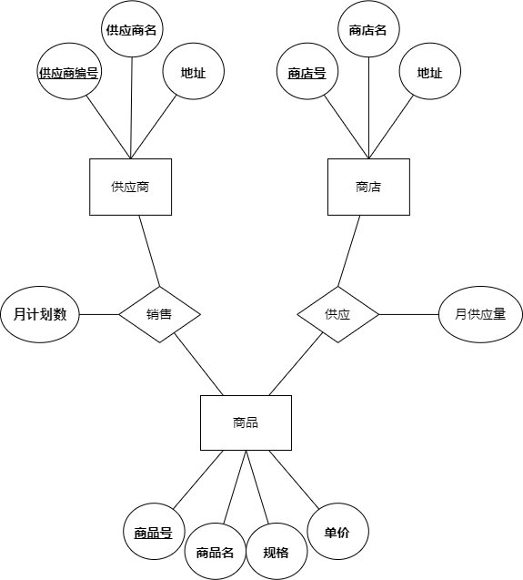

# P35

## 1.名称解释

联系的元数：`与一个联系有关的实体集个数`  
概念数据模型：`独立于计算机系统的数据模型，完全不涉及信息在计算机中的表示，只是用来描述某个特定组织所关心的信息结构。`  
结构数据模型：`直接面向数据库的逻辑结构，它是对现实世界的第二层抽象。这类模型直接于 DBMS 有关，称为“逻辑数据模型”。`  
外模式：`外部级最接近用户，是单个用户所能看到的数据特细。单个用户使用的数据视图的描述称为“外模式”。`  
概念模式：`概念级涉及所有用户的数据定义，也就是全局性的数据视图。全局数据视图的描述称为“概念模式”。`  
内模式：`内部级最接近物理存储设备，涉及物理数据存储的结构。物理存储数据视图的描述称为“内模式”。`  
外模式/模式映像：`外模式/模式映像存在于外部级和概念级之间，用于定义外模式和概念模式之间的对应性。`  
模式/内模式映像：`模式/内模式映像存在于概念级和内部级之间，用于定义概念模式和内模式之间的对应性。`  
数据独立性：`数据独立性（Data Independence）是指应用程序和数据库的数据结构之间相互独立，不受影响。`  
物理数据独立性：`如果数据库的内模式要修改，即数据库的物理结构发生变化，那么只要对模式/内模式映像作相应修改，就可以使概念模式尽可能地保持不变。也就是对内模式的修改尽量不影响概念模式，当然对于外模式和应用程序影响更小，这样，就可以说数据库达到了物理数据独立性（简称物理独立性）。`  
逻辑数据独立性：`如果数据库的概念模式要修改，例如增加记录类型或增加数据项，那么只要对外模式/模式映像作相应修改，就可以使外模式和应用程序尽可能地保持不变。这样，就可以所数据库达到了逻辑数据独立性（简称逻辑独立性）。`  
DD：`数据库系统中存放三级结构定义的数据库称为数据字典（Data DIctionary，DD）。`  

## 2.逻辑记录与物理记录，逻辑文件与物理文件有些什么联系和区别？

    逻辑记录是指应用程序中对数据进行操作和访问的基本单位。逻辑记录可以包含一个或多个逻辑字段，它们按照一定的逻辑结构组织在一起。逻辑记录是应用程序对数据进行操作和访问的单位。

    物理记录是指数据在存储介质上的实际存储形式。物理记录是由逻辑记录转化为存储设备上的二进制数据，以便于存储和访问。

    逻辑文件是指在应用程序中对数据进行操作和访问的逻辑单位。逻辑文件由一个或多个逻辑记录组成，它们按照一定的逻辑关系组织在一起。逻辑文件是应用程序对数据进行操作和访问的单位。

    物理文件是指在存储设备上实际存储的数据文件。物理文件是由逻辑文件转化为存储设备上的二进制数据文件。物理文件的组织方式和存储结构是由底层存储设备的特性和物理结构决定的。

    联系：逻辑记录与物理记录、逻辑文件与物理文件都是数据存储的概念，都是用来组织和管理数据的。逻辑记录和逻辑文件是应用程序对数据进行操作和访问的逻辑单位，而物理记录和物理文件是实际存储在存储设备上的数据形式。

    区别：逻辑记录和逻辑文件是应用程序层面的概念，对数据的组织和访问进行逻辑上的划分；而物理记录和物理文件是底层存储设备上实际存储数据的形式，是存储设备层面的概念。逻辑记录和逻辑文件的组织方式和结构是由应用程序决定的；而物理记录和物理文件的组织方式和结构是由底层存储设备的特性和物理结构决定的。

## 3.设某商业集团数据库有三个实体集。一是“商品”实体集，属性有商品号、商品名、规格、单价等；二是“商店”实体集，属性有商店号、商店名、地址等；三是“供应商”实体集，属性有供应商编号、供应商名、地址等

## 供应商与商品之间存在“供应”联系，每个供应商可供应多种商品，每种商品可向多个供应商订购，每个供应商供应每种商品有个月供应量；商店与商品间存在“销售”联系，每个商店可销售多种商品，每种商品可在多个商店销售，每个商店销售每种商品有个月计划数

## 试画出反映上述问题的ER图，并将其转换成关系模型

关系模型:  
| 关系模型|
|--------|
|供应商(<u>供应商编号</u>，供应商名，地址)|
|商店(<u>商店号</u>，商店名，地址)|
|商品(<u>商品号</u>，商品名，规格，单价)|
|供应(<u>供应商编号，商品号</u>，月供应量)|
|销售(<u>商店号，商品号</u>，月计划数)|

## 11.试述DBMS的主要功能

    DBMS（数据库管理系统）是一种用来管理和操作数据库的软件系统，其主要功能包括:

    数据定义功能（DDL）：用于创建、修改和删除数据库中的表、索引、视图等数据库对象，定义数据的结构和约束。

    数据操纵功能（DML）：用于查询、插入、更新和删除数据库中的数据，提供灵活的数据操作和数据维护能力。

    数据控制功能（DCL）：用于定义和管理数据库的安全性和完整性，包括授权、权限管理和事务控制等。

    数据库管理功能：包括备份和恢复数据库、性能优化、数据压缩和索引管理等，用于保证数据库的稳定性和可靠性。

    数据库存储功能：用于存储数据库的数据和元数据，包括数据文件管理、数据缓存和空间管理等。

    数据库查询功能：提供数据查询和数据分析的能力，包括数据查询语言（如SQL）和查询优化器等。

    总的来说，DBMS的主要功能是提供一个集中化和统一化的数据库管理环境，用于管理和操作数据库，实现数据的存储、查询、修改、删除等操作，以及确保数据库的安全性和完整性，提高数据处理的效率和性能

## 15.DBS有哪几部分组成？

    DBS由三个主要部分组成：

    数据库管理系统（Database Management System，DBMS）：DBS的核心组成部分，用于管理数据库的创建、组织、访问和维护等工作。它可以提供数据安全性、数据完整性和数据一致性等功能，同时还能对数据库进行性能优化和监控。

    数据库（Database）：用于存储和组织数据的集合。数据库是一个结构化的数据集合，其中包含了不同类型的数据表、关系、视图、索引等对象，可以通过DBS进行访问和操作。

    数据库应用程序（Database Application）：用于与数据库进行交互的软件程序。数据库应用程序可以通过DBS提供的接口来实现数据的增删改查等操作，常见的数据库应用程序有Web应用、移动应用、企业管理系统等。